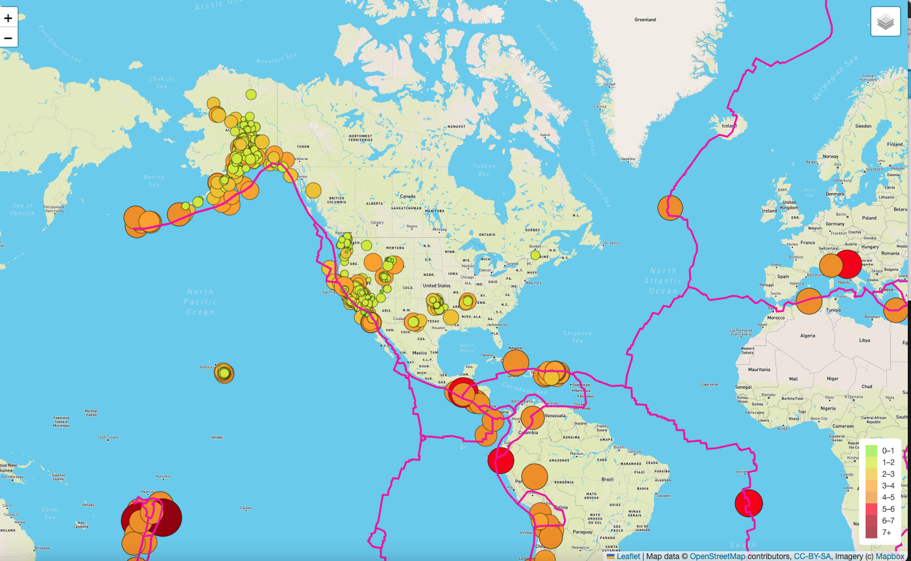

# Mapping Earthquakes

## Project Overview 

This project aimed to map recorded earthquake events in the past 7 days. Later, the map was improved by adding tectonic plates data as an overlay to view all earthquakes along with the tectonic plates.

- Here's a screenshot showing the map with earthquake and tectonic plate data as overlays.

- This is the street layer

- Here we can see the tectonic plates as an overlay and the satellite layer.

- Finally, we can observe the major earthquakes as an overlay. 
